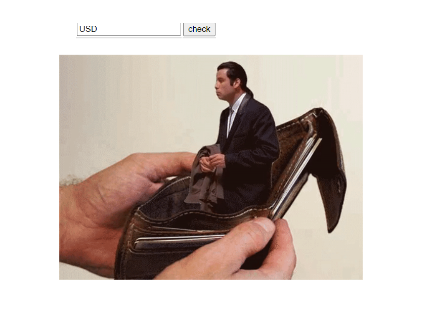

## Gif

Cервис, который обращается к сервису курсов валют, и отдает gif в ответ:
если курс по отношению к рублю за сегодня стал выше вчерашнего, то отдаем рандомную отсюда https://giphy.com/search/rich 
если ниже - отсюда https://giphy.com/search/broke 

REST API курсов валют - https://docs.openexchangerates.org/

REST API гифок - https://developers.giphy.com/docs/api#quick-start-guide

Сборка Gradle

## Демонстрация

## Запуск проекта
gradle build

java -jar build/libs/gifGradle-0.0.1-SNAPSHOT.jar
